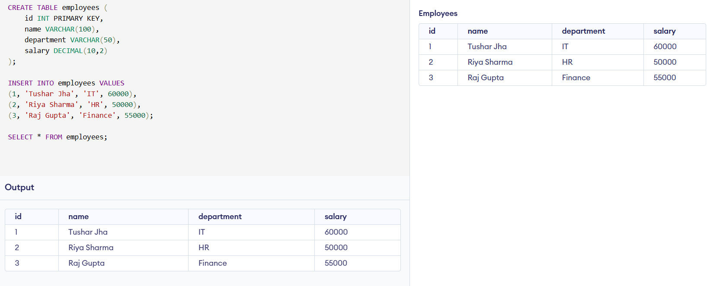
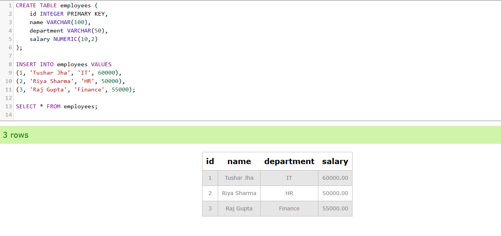

# DATABASE-MIGRATION

*COMPANY NAME*: CODTECH IT SOLUTIONS

*NAME*: TUSHAR JHA

*INTERN ID*: CT04DM1383

*DOMAIN*: SQL

*DURATION*: 4 WEEKS

*MENTOR*:  NEELA SANTOSH

#  Internship Task 3: Database Migration

##  Objective
To migrate data from a MySQL database to a PostgreSQL database while ensuring that the structure and integrity of the data remain intact.

---

##  Files Included

| File Name             | Description                                  |
|-----------------------|----------------------------------------------|
| `sample_data.sql`     | MySQL-compatible table and sample data       |
| `mysql_export.sql`    | Simulated export from MySQL                  |
| `postgres_import.sql` | Converted version for PostgreSQL             |
| `migration_summary.md`| Summary report of the migration process      |
| `mysql_output.png`    | Screenshot of MySQL table and data output    |
| `postgres_output.png` | Screenshot of PostgreSQL table and data      |

---

##  Summary of Steps

1. Created a sample `employees` table and inserted records in MySQL.
2. Exported the schema and data using SQL scripts.
3. Converted MySQL-specific syntax to PostgreSQL-friendly syntax.
4. Imported the data into PostgreSQL successfully.
5. Verified that all records and structure were maintained.

---

##  Data Integrity
- Total Records Migrated: **3**
- Data Matched: ✔️ Yes
- Structure Maintained: ✔️ Yes

---

##  Tools Used
- MySQL
- PostgreSQL
- Online SQL editors (db-fiddle.com, extendsclass.com)

---

##  Output Previews

**MySQL Output:**  

**PostgreSQL Output:**  

